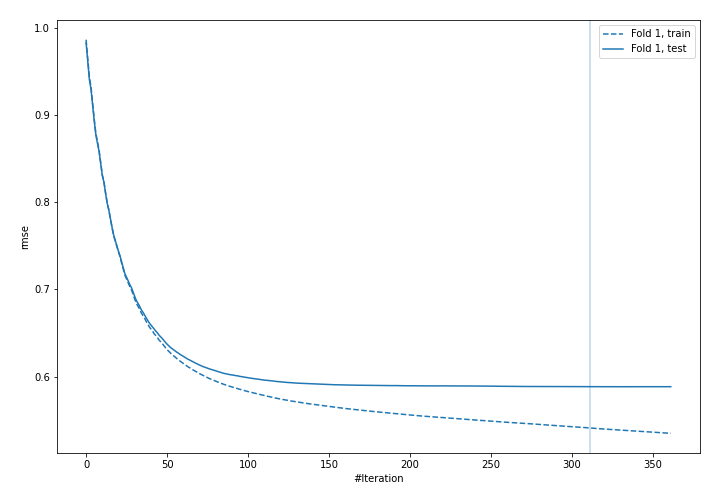
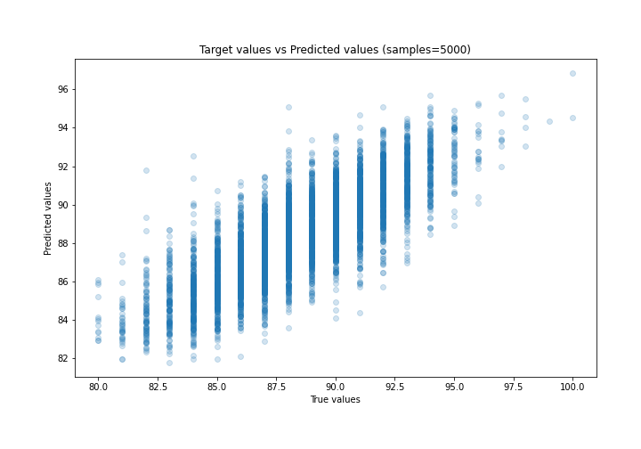
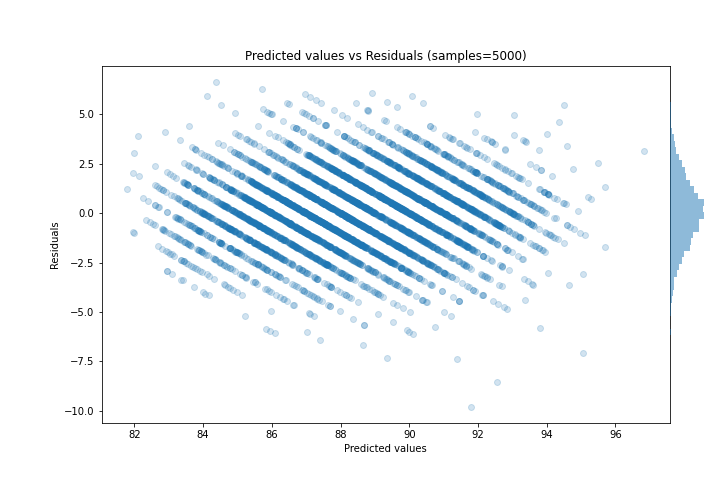

# Summary of 25_LightGBM_RandomFeature

[<< Go back](../README.md)

## LightGBM
- **n_jobs**: -1
- **objective**: regression
- **num_leaves**: 127
- **learning_rate**: 0.05
- **feature_fraction**: 0.5
- **bagging_fraction**: 0.5
- **min_data_in_leaf**: 20
- **metric**: rmse
- **custom_eval_metric_name**: None
- **explain_level**: 1

## Validation
 - **validation_type**: split
 - **train_ratio**: 0.9
 - **shuffle**: True

## Optimized metric
rmse

## Training time

36.6 seconds

### Metric details:
| Metric   |     Score |
|:---------|----------:|
| MAE      | 1.42242   |
| MSE      | 3.33018   |
| RMSE     | 1.82488   |
| R2       | 0.651351  |
| MAPE     | 0.0161175 |

## Learning curves

## Permutation-based Importance

## True vs Predicted

## Predicted vs Residuals

[<< Go back](../README.md)
