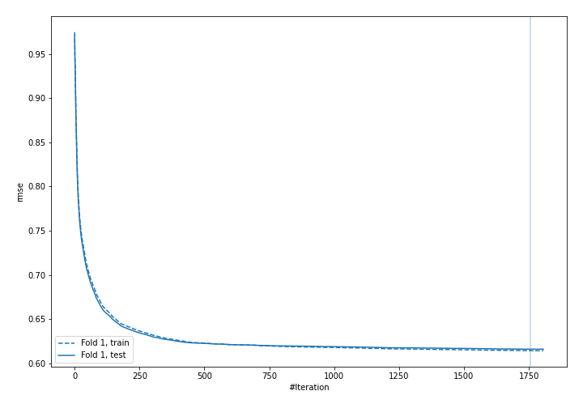
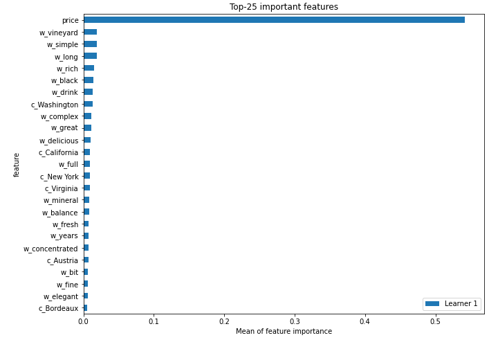
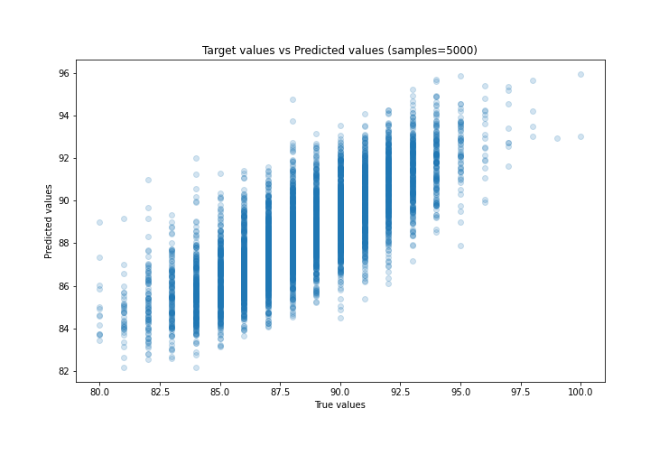
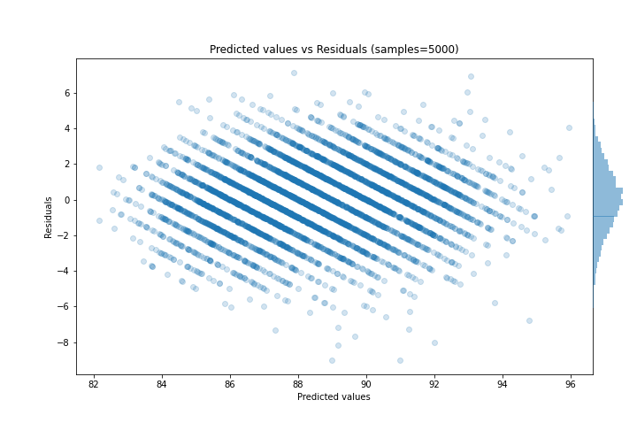

# Summary of 34_CatBoost

[<< Go back](../README.md)

## CatBoost
- **n_jobs**: -1
- **learning_rate**: 0.1
- **depth**: 4
- **rsm**: 0.7
- **loss_function**: MAPE
- **eval_metric**: RMSE
- **explain_level**: 2

## Validation
 - **validation_type**: split
 - **train_ratio**: 0.9
 - **shuffle**: True

## Optimized metric
rmse

## Training time

36.0 seconds

### Metric details:
| Metric   |     Score |
|:---------|----------:|
| MAE      | 1.49082   |
| MSE      | 3.64784   |
| RMSE     | 1.90993   |
| R2       | 0.618094  |
| MAPE     | 0.0169179 |

## Learning curves

## Permutation-based Importance

## True vs Predicted

## Predicted vs Residuals

[<< Go back](../README.md)
