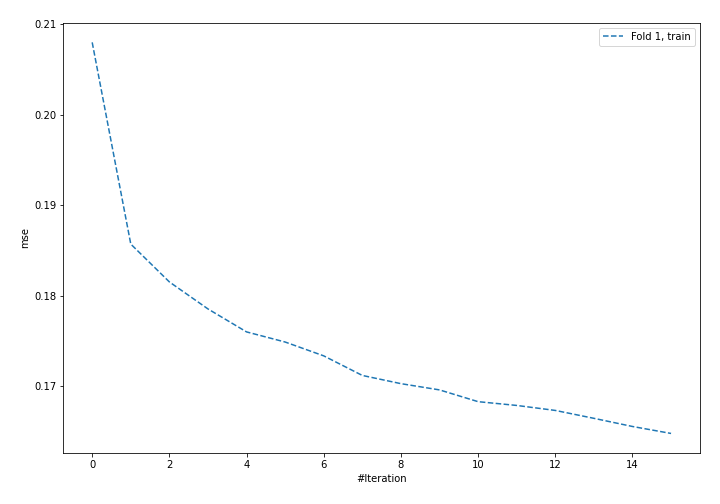
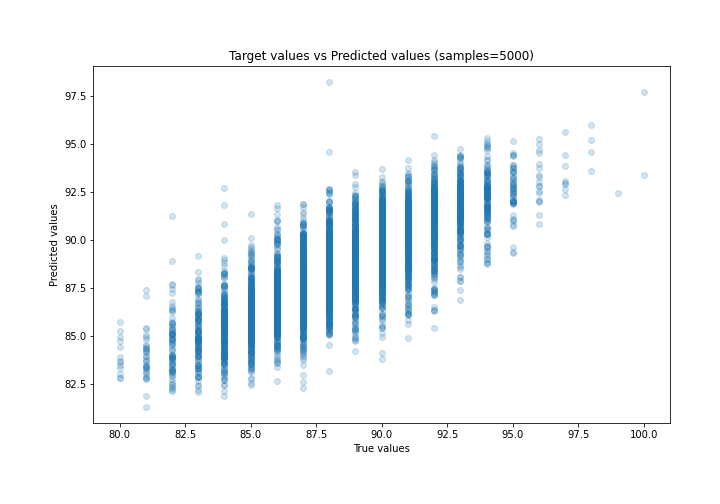
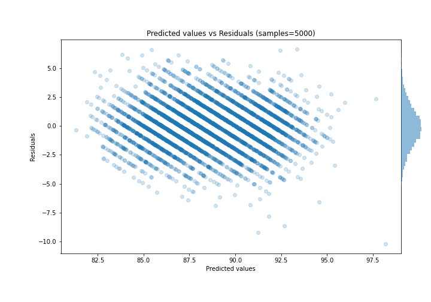

# Summary of 57_NeuralNetwork_SelectedFeatures

[<< Go back](../README.md)

## Neural Network
- **n_jobs**: -1
- **dense_1_size**: 64
- **dense_2_size**: 16
- **learning_rate**: 0.01
- **explain_level**: 2

## Validation
 - **validation_type**: split
 - **train_ratio**: 0.9
 - **shuffle**: True

## Optimized metric
rmse

## Training time

15.8 seconds

### Metric details:
| Metric   |     Score |
|:---------|----------:|
| MAE      | 1.45164   |
| MSE      | 3.48118   |
| RMSE     | 1.86579   |
| R2       | 0.635542  |
| MAPE     | 0.0164675 |

## Learning curves

## Permutation-based Importance

## True vs Predicted

## Predicted vs Residuals

[<< Go back](../README.md)
