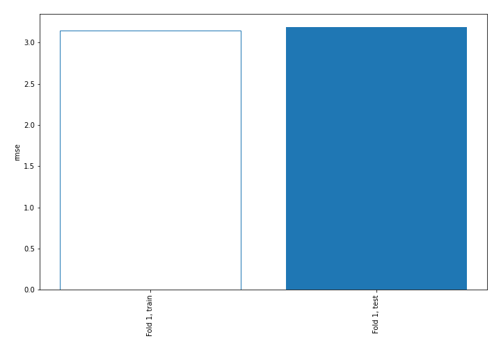
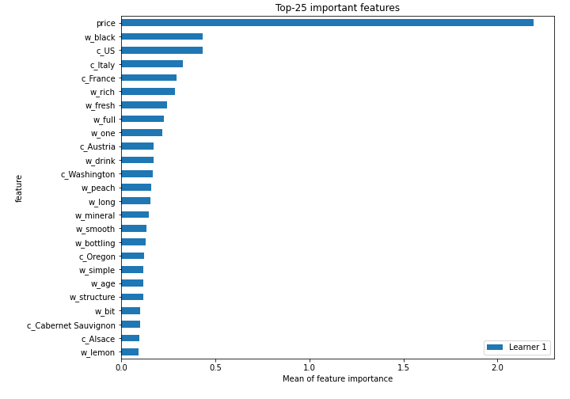
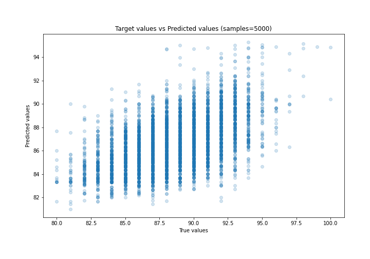

# Summary of 71_NearestNeighbors

[<< Go back](../README.md)

## k-Nearest Neighbors (Nearest Neighbors)
- **n_jobs**: -1
- **n_neighbors**: 3
- **weights**: distance
- **explain_level**: 2

## Validation
 - **validation_type**: split
 - **train_ratio**: 0.9
 - **shuffle**: True

## Optimized metric
rmse

## Training time

24.3 seconds

### Metric details:
| Metric   |      Score |
|:---------|-----------:|
| MAE      |  2.54456   |
| MSE      | 10.1728    |
| RMSE     |  3.18948   |
| R2       | -0.0650261 |
| MAPE     |  0.0284333 |

## Learning curves

## Permutation-based Importance

## True vs Predicted

## Predicted vs Residuals

[<< Go back](../README.md)
