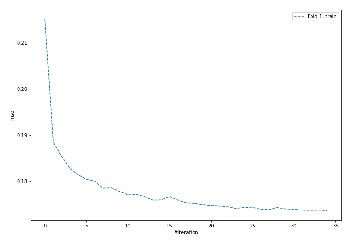
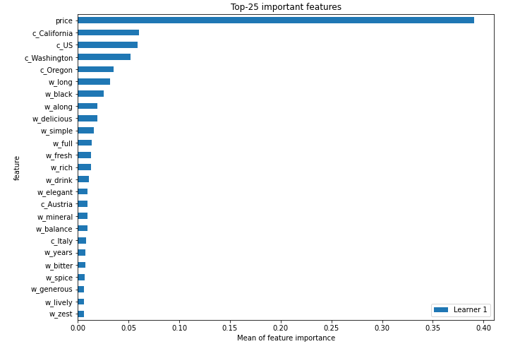
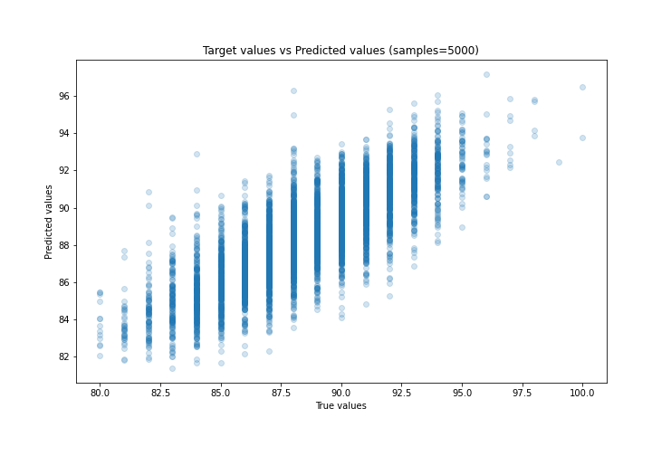
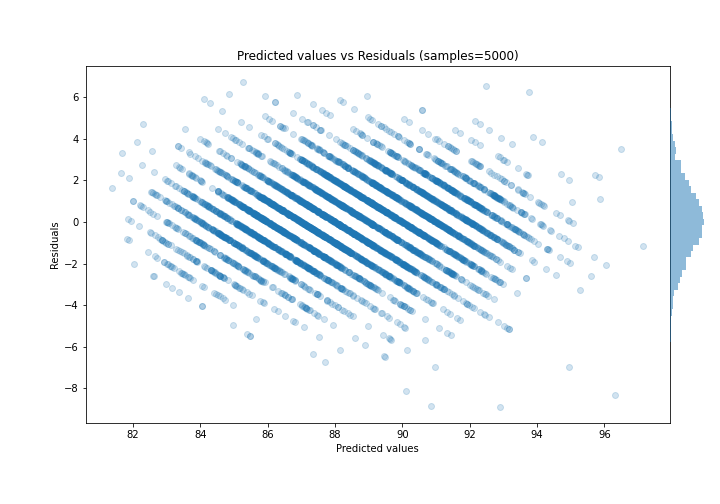

# Summary of 87_NeuralNetwork

[<< Go back](../README.md)

## Neural Network
- **n_jobs**: -1
- **dense_1_size**: 16
- **dense_2_size**: 8
- **learning_rate**: 0.01
- **explain_level**: 2

## Validation
 - **validation_type**: split
 - **train_ratio**: 0.9
 - **shuffle**: True

## Optimized metric
rmse

## Training time

25.1 seconds

### Metric details:
| Metric   |     Score |
|:---------|----------:|
| MAE      | 1.44664   |
| MSE      | 3.43747   |
| RMSE     | 1.85404   |
| R2       | 0.640119  |
| MAPE     | 0.0163887 |

## Learning curves

## Permutation-based Importance

## True vs Predicted

## Predicted vs Residuals

[<< Go back](../README.md)
