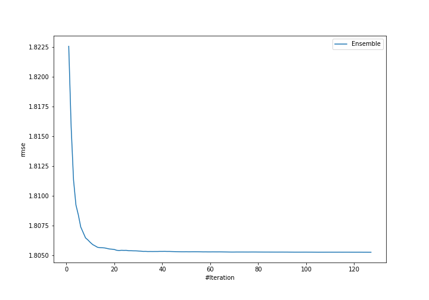
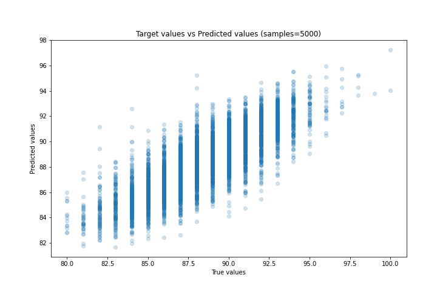
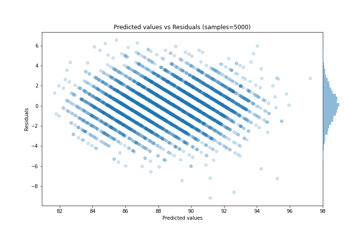

# Summary of Ensemble

[<< Go back](../README.md)

## Ensemble structure
| Model                             |   Weight |
|:----------------------------------|---------:|
| 105_CatBoost_GoldenFeatures       |        1 |
| 11_Xgboost                        |        4 |
| 18_Xgboost                        |        8 |
| 21_LightGBM                       |        1 |
| 24_LightGBM                       |        7 |
| 26_LightGBM_GoldenFeatures        |       10 |
| 36_CatBoost                       |        1 |
| 4_Default_LightGBM                |        1 |
| 56_NeuralNetwork                  |        7 |
| 57_NeuralNetwork                  |       13 |
| 57_NeuralNetwork_SelectedFeatures |       10 |
| 58_NeuralNetwork                  |        1 |
| 5_Default_Xgboost                 |        3 |
| 61_NeuralNetwork                  |        4 |
| 62_NeuralNetwork                  |        4 |
| 6_Default_CatBoost                |       10 |
| 77_LightGBM_GoldenFeatures        |        2 |
| 78_LightGBM_GoldenFeatures        |        7 |
| 79_LightGBM                       |        6 |
| 7_Default_NeuralNetwork           |        1 |
| 80_LightGBM                       |        2 |
| 86_NeuralNetwork                  |       11 |
| 87_NeuralNetwork                  |        8 |
| 89_NeuralNetwork                  |        5 |

### Metric details:
| Metric   |     Score |
|:---------|----------:|
| MAE      | 1.40495   |
| MSE      | 3.25893   |
| RMSE     | 1.80525   |
| R2       | 0.65881   |
| MAPE     | 0.0159215 |

## Learning curves

## True vs Predicted

## Predicted vs Residuals

[<< Go back](../README.md)
