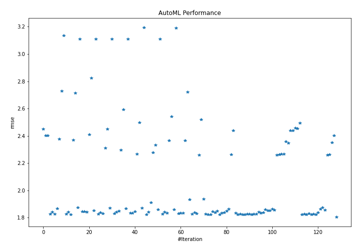
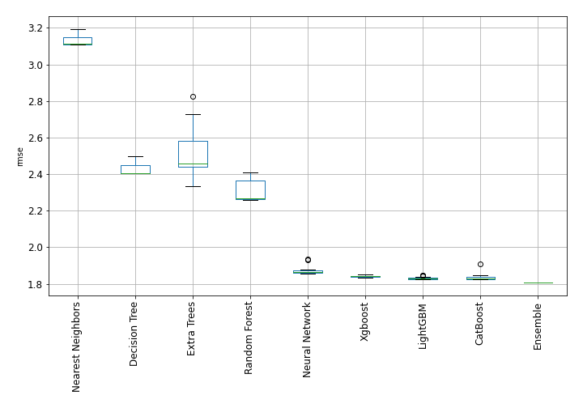
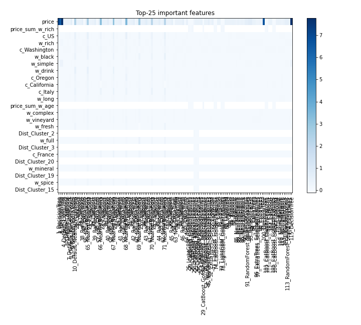
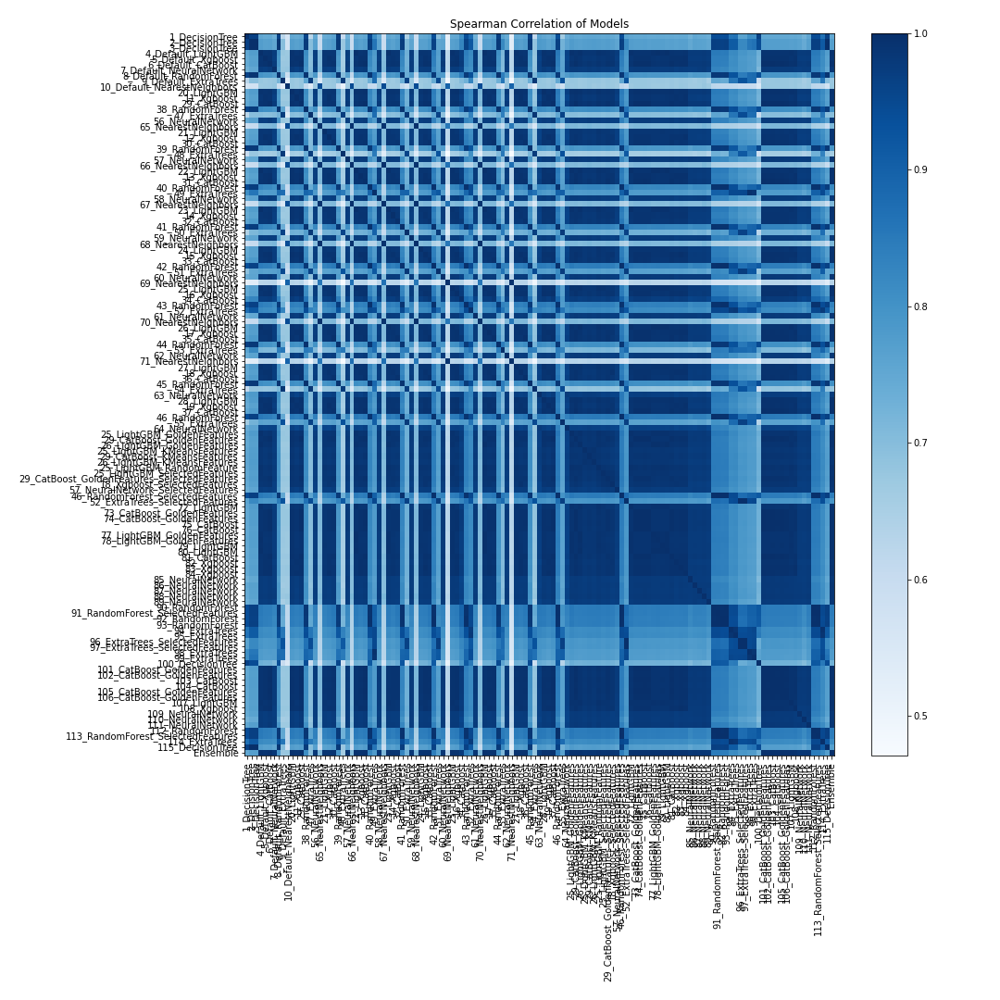

# AutoML Leaderboard

| Best model   | name                                                                                                 | model_type        | metric_type   |   metric_value |   train_time |
|:-------------|:-----------------------------------------------------------------------------------------------------|:------------------|:--------------|---------------:|-------------:|
|              | [1_DecisionTree](1_DecisionTree/README.md)                                                           | Decision Tree     | rmse          |        2.45077 |        64.23 |
|              | [2_DecisionTree](2_DecisionTree/README.md)                                                           | Decision Tree     | rmse          |        2.40264 |        57.4  |
|              | [3_DecisionTree](3_DecisionTree/README.md)                                                           | Decision Tree     | rmse          |        2.40264 |        56.99 |
|              | [4_Default_LightGBM](4_Default_LightGBM/README.md)                                                   | LightGBM          | rmse          |        1.82626 |        58.84 |
|              | [5_Default_Xgboost](5_Default_Xgboost/README.md)                                                     | Xgboost           | rmse          |        1.84078 |        90.13 |
|              | [6_Default_CatBoost](6_Default_CatBoost/README.md)                                                   | CatBoost          | rmse          |        1.82647 |        52.97 |
|              | [7_Default_NeuralNetwork](7_Default_NeuralNetwork/README.md)                                         | Neural Network    | rmse          |        1.86755 |        26.65 |
|              | [8_Default_RandomForest](8_Default_RandomForest/README.md)                                           | Random Forest     | rmse          |        2.3758  |        30.71 |
|              | [9_Default_ExtraTrees](9_Default_ExtraTrees/README.md)                                               | Extra Trees       | rmse          |        2.72864 |        47.45 |
|              | [10_Default_NearestNeighbors](10_Default_NearestNeighbors/README.md)                                 | Nearest Neighbors | rmse          |        3.13487 |        24.47 |
|              | [20_LightGBM](20_LightGBM/README.md)                                                                 | LightGBM          | rmse          |        1.82718 |        55.79 |
|              | [11_Xgboost](11_Xgboost/README.md)                                                                   | Xgboost           | rmse          |        1.84354 |        97.59 |
|              | [29_CatBoost](29_CatBoost/README.md)                                                                 | CatBoost          | rmse          |        1.82487 |        71.29 |
|              | [38_RandomForest](38_RandomForest/README.md)                                                         | Random Forest     | rmse          |        2.36858 |        30.1  |
|              | [47_ExtraTrees](47_ExtraTrees/README.md)                                                             | Extra Trees       | rmse          |        2.7125  |        31.96 |
|              | [56_NeuralNetwork](56_NeuralNetwork/README.md)                                                       | Neural Network    | rmse          |        1.87509 |        16.54 |
|              | [65_NearestNeighbors](65_NearestNeighbors/README.md)                                                 | Nearest Neighbors | rmse          |        3.11135 |        23.6  |
|              | [21_LightGBM](21_LightGBM/README.md)                                                                 | LightGBM          | rmse          |        1.84426 |        31.91 |
|              | [12_Xgboost](12_Xgboost/README.md)                                                                   | Xgboost           | rmse          |        1.84639 |        90.71 |
|              | [30_CatBoost](30_CatBoost/README.md)                                                                 | CatBoost          | rmse          |        1.84259 |        51.69 |
|              | [39_RandomForest](39_RandomForest/README.md)                                                         | Random Forest     | rmse          |        2.41    |        30.33 |
|              | [48_ExtraTrees](48_ExtraTrees/README.md)                                                             | Extra Trees       | rmse          |        2.82373 |        61.18 |
|              | [57_NeuralNetwork](57_NeuralNetwork/README.md)                                                       | Neural Network    | rmse          |        1.85389 |        16.33 |
|              | [66_NearestNeighbors](66_NearestNeighbors/README.md)                                                 | Nearest Neighbors | rmse          |        3.10841 |        24.76 |
|              | [22_LightGBM](22_LightGBM/README.md)                                                                 | LightGBM          | rmse          |        1.82643 |        55.56 |
|              | [13_Xgboost](13_Xgboost/README.md)                                                                   | Xgboost           | rmse          |        1.83929 |        77.76 |
|              | [31_CatBoost](31_CatBoost/README.md)                                                                 | CatBoost          | rmse          |        1.83031 |        39    |
|              | [40_RandomForest](40_RandomForest/README.md)                                                         | Random Forest     | rmse          |        2.31001 |       131.66 |
|              | [49_ExtraTrees](49_ExtraTrees/README.md)                                                             | Extra Trees       | rmse          |        2.44908 |        39.42 |
|              | [58_NeuralNetwork](58_NeuralNetwork/README.md)                                                       | Neural Network    | rmse          |        1.87067 |        27.05 |
|              | [67_NearestNeighbors](67_NearestNeighbors/README.md)                                                 | Nearest Neighbors | rmse          |        3.10841 |        27.54 |
|              | [23_LightGBM](23_LightGBM/README.md)                                                                 | LightGBM          | rmse          |        1.83177 |        63.99 |
|              | [14_Xgboost](14_Xgboost/README.md)                                                                   | Xgboost           | rmse          |        1.8434  |        51.43 |
|              | [32_CatBoost](32_CatBoost/README.md)                                                                 | CatBoost          | rmse          |        1.84799 |        24.89 |
|              | [41_RandomForest](41_RandomForest/README.md)                                                         | Random Forest     | rmse          |        2.29619 |        32.76 |
|              | [50_ExtraTrees](50_ExtraTrees/README.md)                                                             | Extra Trees       | rmse          |        2.59491 |        47.18 |
|              | [59_NeuralNetwork](59_NeuralNetwork/README.md)                                                       | Neural Network    | rmse          |        1.86806 |        14.98 |
|              | [68_NearestNeighbors](68_NearestNeighbors/README.md)                                                 | Nearest Neighbors | rmse          |        3.11135 |        25.24 |
|              | [24_LightGBM](24_LightGBM/README.md)                                                                 | LightGBM          | rmse          |        1.83496 |        24.57 |
|              | [15_Xgboost](15_Xgboost/README.md)                                                                   | Xgboost           | rmse          |        1.83565 |        59.3  |
|              | [33_CatBoost](33_CatBoost/README.md)                                                                 | CatBoost          | rmse          |        1.84436 |        57.7  |
|              | [42_RandomForest](42_RandomForest/README.md)                                                         | Random Forest     | rmse          |        2.26772 |        38.37 |
|              | [51_ExtraTrees](51_ExtraTrees/README.md)                                                             | Extra Trees       | rmse          |        2.4963  |        40.38 |
|              | [60_NeuralNetwork](60_NeuralNetwork/README.md)                                                       | Neural Network    | rmse          |        1.87158 |        15.47 |
|              | [69_NearestNeighbors](69_NearestNeighbors/README.md)                                                 | Nearest Neighbors | rmse          |        3.19453 |        24.7  |
|              | [25_LightGBM](25_LightGBM/README.md)                                                                 | LightGBM          | rmse          |        1.82347 |        84.1  |
|              | [16_Xgboost](16_Xgboost/README.md)                                                                   | Xgboost           | rmse          |        1.84309 |        64.46 |
|              | [34_CatBoost](34_CatBoost/README.md)                                                                 | CatBoost          | rmse          |        1.90993 |        36.73 |
|              | [43_RandomForest](43_RandomForest/README.md)                                                         | Random Forest     | rmse          |        2.27761 |        54.9  |
|              | [52_ExtraTrees](52_ExtraTrees/README.md)                                                             | Extra Trees       | rmse          |        2.33462 |        43.14 |
|              | [61_NeuralNetwork](61_NeuralNetwork/README.md)                                                       | Neural Network    | rmse          |        1.8608  |        17.76 |
|              | [70_NearestNeighbors](70_NearestNeighbors/README.md)                                                 | Nearest Neighbors | rmse          |        3.11135 |        27.06 |
|              | [26_LightGBM](26_LightGBM/README.md)                                                                 | LightGBM          | rmse          |        1.82597 |        58.16 |
|              | [17_Xgboost](17_Xgboost/README.md)                                                                   | Xgboost           | rmse          |        1.84388 |       110.48 |
|              | [35_CatBoost](35_CatBoost/README.md)                                                                 | CatBoost          | rmse          |        1.83528 |       155.63 |
|              | [44_RandomForest](44_RandomForest/README.md)                                                         | Random Forest     | rmse          |        2.36695 |        38.65 |
|              | [53_ExtraTrees](53_ExtraTrees/README.md)                                                             | Extra Trees       | rmse          |        2.54382 |        32.45 |
|              | [62_NeuralNetwork](62_NeuralNetwork/README.md)                                                       | Neural Network    | rmse          |        1.86042 |        16.98 |
|              | [71_NearestNeighbors](71_NearestNeighbors/README.md)                                                 | Nearest Neighbors | rmse          |        3.18948 |        24.93 |
|              | [27_LightGBM](27_LightGBM/README.md)                                                                 | LightGBM          | rmse          |        1.83192 |        36.38 |
|              | [18_Xgboost](18_Xgboost/README.md)                                                                   | Xgboost           | rmse          |        1.83462 |        57.35 |
|              | [36_CatBoost](36_CatBoost/README.md)                                                                 | CatBoost          | rmse          |        1.8357  |        61.85 |
|              | [45_RandomForest](45_RandomForest/README.md)                                                         | Random Forest     | rmse          |        2.36579 |        38.7  |
|              | [54_ExtraTrees](54_ExtraTrees/README.md)                                                             | Extra Trees       | rmse          |        2.72313 |        33.73 |
|              | [63_NeuralNetwork](63_NeuralNetwork/README.md)                                                       | Neural Network    | rmse          |        1.93259 |        16.22 |
|              | [28_LightGBM](28_LightGBM/README.md)                                                                 | LightGBM          | rmse          |        1.82818 |        54.33 |
|              | [19_Xgboost](19_Xgboost/README.md)                                                                   | Xgboost           | rmse          |        1.83737 |       142.9  |
|              | [37_CatBoost](37_CatBoost/README.md)                                                                 | CatBoost          | rmse          |        1.82925 |       128.15 |
|              | [46_RandomForest](46_RandomForest/README.md)                                                         | Random Forest     | rmse          |        2.2598  |        35.14 |
|              | [55_ExtraTrees](55_ExtraTrees/README.md)                                                             | Extra Trees       | rmse          |        2.52043 |        35.37 |
|              | [64_NeuralNetwork](64_NeuralNetwork/README.md)                                                       | Neural Network    | rmse          |        1.93562 |        15.61 |
|              | [25_LightGBM_GoldenFeatures](25_LightGBM_GoldenFeatures/README.md)                                   | LightGBM          | rmse          |        1.82807 |        90.28 |
|              | [29_CatBoost_GoldenFeatures](29_CatBoost_GoldenFeatures/README.md)                                   | CatBoost          | rmse          |        1.82425 |       108.03 |
|              | [26_LightGBM_GoldenFeatures](26_LightGBM_GoldenFeatures/README.md)                                   | LightGBM          | rmse          |        1.82534 |        73.05 |
|              | [25_LightGBM_KMeansFeatures](25_LightGBM_KMeansFeatures/README.md)                                   | LightGBM          | rmse          |        1.84526 |        86.36 |
|              | [29_CatBoost_KMeansFeatures](29_CatBoost_KMeansFeatures/README.md)                                   | CatBoost          | rmse          |        1.83771 |        95.56 |
|              | [26_LightGBM_KMeansFeatures](26_LightGBM_KMeansFeatures/README.md)                                   | LightGBM          | rmse          |        1.84765 |        68.68 |
|              | [25_LightGBM_RandomFeature](25_LightGBM_RandomFeature/README.md)                                     | LightGBM          | rmse          |        1.82488 |        37.3  |
|              | [25_LightGBM_SelectedFeatures](25_LightGBM_SelectedFeatures/README.md)                               | LightGBM          | rmse          |        1.83653 |        71.66 |
|              | [29_CatBoost_GoldenFeatures_SelectedFeatures](29_CatBoost_GoldenFeatures_SelectedFeatures/README.md) | CatBoost          | rmse          |        1.83712 |        90.97 |
|              | [18_Xgboost_SelectedFeatures](18_Xgboost_SelectedFeatures/README.md)                                 | Xgboost           | rmse          |        1.84917 |        55.68 |
|              | [57_NeuralNetwork_SelectedFeatures](57_NeuralNetwork_SelectedFeatures/README.md)                     | Neural Network    | rmse          |        1.86579 |        16.44 |
|              | [46_RandomForest_SelectedFeatures](46_RandomForest_SelectedFeatures/README.md)                       | Random Forest     | rmse          |        2.26342 |        46.96 |
|              | [52_ExtraTrees_SelectedFeatures](52_ExtraTrees_SelectedFeatures/README.md)                           | Extra Trees       | rmse          |        2.43974 |        72.78 |
|              | [72_LightGBM](72_LightGBM/README.md)                                                                 | LightGBM          | rmse          |        1.83309 |        63.91 |
|              | [73_CatBoost_GoldenFeatures](73_CatBoost_GoldenFeatures/README.md)                                   | CatBoost          | rmse          |        1.82368 |       113.21 |
|              | [74_CatBoost_GoldenFeatures](74_CatBoost_GoldenFeatures/README.md)                                   | CatBoost          | rmse          |        1.82659 |       109.21 |
|              | [75_CatBoost](75_CatBoost/README.md)                                                                 | CatBoost          | rmse          |        1.82517 |        73.07 |
|              | [76_CatBoost](76_CatBoost/README.md)                                                                 | CatBoost          | rmse          |        1.82391 |        91.97 |
|              | [77_LightGBM_GoldenFeatures](77_LightGBM_GoldenFeatures/README.md)                                   | LightGBM          | rmse          |        1.82596 |        69.3  |
|              | [78_LightGBM_GoldenFeatures](78_LightGBM_GoldenFeatures/README.md)                                   | LightGBM          | rmse          |        1.82624 |        66.78 |
|              | [79_LightGBM](79_LightGBM/README.md)                                                                 | LightGBM          | rmse          |        1.82445 |        69.86 |
|              | [80_LightGBM](80_LightGBM/README.md)                                                                 | LightGBM          | rmse          |        1.82616 |        75.72 |
|              | [81_CatBoost](81_CatBoost/README.md)                                                                 | CatBoost          | rmse          |        1.82832 |        50.42 |
|              | [82_Xgboost](82_Xgboost/README.md)                                                                   | Xgboost           | rmse          |        1.84197 |        71.15 |
|              | [83_Xgboost](83_Xgboost/README.md)                                                                   | Xgboost           | rmse          |        1.83422 |        65.23 |
|              | [84_Xgboost](84_Xgboost/README.md)                                                                   | Xgboost           | rmse          |        1.83666 |       124.5  |
|              | [85_NeuralNetwork](85_NeuralNetwork/README.md)                                                       | Neural Network    | rmse          |        1.86124 |        20.59 |
|              | [86_NeuralNetwork](86_NeuralNetwork/README.md)                                                       | Neural Network    | rmse          |        1.85441 |        23.57 |
|              | [87_NeuralNetwork](87_NeuralNetwork/README.md)                                                       | Neural Network    | rmse          |        1.85404 |        26.12 |
|              | [88_NeuralNetwork](88_NeuralNetwork/README.md)                                                       | Neural Network    | rmse          |        1.86371 |        22.93 |
|              | [89_NeuralNetwork](89_NeuralNetwork/README.md)                                                       | Neural Network    | rmse          |        1.85832 |        20.02 |
|              | [90_RandomForest](90_RandomForest/README.md)                                                         | Random Forest     | rmse          |        2.26089 |        36.95 |
|              | [91_RandomForest_SelectedFeatures](91_RandomForest_SelectedFeatures/README.md)                       | Random Forest     | rmse          |        2.26321 |        48.9  |
|              | [92_RandomForest](92_RandomForest/README.md)                                                         | Random Forest     | rmse          |        2.26839 |        38.64 |
|              | [93_RandomForest](93_RandomForest/README.md)                                                         | Random Forest     | rmse          |        2.26679 |        40.82 |
|              | [94_ExtraTrees](94_ExtraTrees/README.md)                                                             | Extra Trees       | rmse          |        2.35829 |        45.15 |
|              | [95_ExtraTrees](95_ExtraTrees/README.md)                                                             | Extra Trees       | rmse          |        2.34912 |        44.95 |
|              | [96_ExtraTrees_SelectedFeatures](96_ExtraTrees_SelectedFeatures/README.md)                           | Extra Trees       | rmse          |        2.4411  |        74.24 |
|              | [97_ExtraTrees_SelectedFeatures](97_ExtraTrees_SelectedFeatures/README.md)                           | Extra Trees       | rmse          |        2.43987 |        72.78 |
|              | [98_ExtraTrees](98_ExtraTrees/README.md)                                                             | Extra Trees       | rmse          |        2.45761 |        40.75 |
|              | [99_ExtraTrees](99_ExtraTrees/README.md)                                                             | Extra Trees       | rmse          |        2.45503 |        40.67 |
|              | [100_DecisionTree](100_DecisionTree/README.md)                                                       | Decision Tree     | rmse          |        2.49568 |        42.9  |
|              | [101_CatBoost_GoldenFeatures](101_CatBoost_GoldenFeatures/README.md)                                 | CatBoost          | rmse          |        1.82423 |       177.34 |
|              | [102_CatBoost_GoldenFeatures](102_CatBoost_GoldenFeatures/README.md)                                 | CatBoost          | rmse          |        1.82662 |        55.2  |
|              | [103_CatBoost](103_CatBoost/README.md)                                                               | CatBoost          | rmse          |        1.82483 |       144.39 |
|              | [104_CatBoost](104_CatBoost/README.md)                                                               | CatBoost          | rmse          |        1.8295  |        42.79 |
|              | [105_CatBoost_GoldenFeatures](105_CatBoost_GoldenFeatures/README.md)                                 | CatBoost          | rmse          |        1.82254 |       216.44 |
|              | [106_CatBoost_GoldenFeatures](106_CatBoost_GoldenFeatures/README.md)                                 | CatBoost          | rmse          |        1.82643 |        60.05 |
|              | [107_LightGBM](107_LightGBM/README.md)                                                               | LightGBM          | rmse          |        1.82291 |        65.15 |
|              | [108_Xgboost](108_Xgboost/README.md)                                                                 | Xgboost           | rmse          |        1.83788 |        60.99 |
|              | [109_NeuralNetwork](109_NeuralNetwork/README.md)                                                     | Neural Network    | rmse          |        1.865   |        18.76 |
|              | [110_NeuralNetwork](110_NeuralNetwork/README.md)                                                     | Neural Network    | rmse          |        1.87646 |        21.52 |
|              | [111_NeuralNetwork](111_NeuralNetwork/README.md)                                                     | Neural Network    | rmse          |        1.85549 |        17.25 |
|              | [112_RandomForest](112_RandomForest/README.md)                                                       | Random Forest     | rmse          |        2.26065 |        36.98 |
|              | [113_RandomForest_SelectedFeatures](113_RandomForest_SelectedFeatures/README.md)                     | Random Forest     | rmse          |        2.26403 |        46.1  |
|              | [114_ExtraTrees](114_ExtraTrees/README.md)                                                           | Extra Trees       | rmse          |        2.35211 |        44.18 |
|              | [115_DecisionTree](115_DecisionTree/README.md)                                                       | Decision Tree     | rmse          |        2.40264 |        60.09 |
| **the best** | [Ensemble](Ensemble/README.md)                                                                       | Ensemble          | rmse          |        1.80525 |        71.67 |

### AutoML Performance

### AutoML Performance Boxplot

### Features Importance

### Spearman Correlation of Models

