# Exploratory Data Analysis

[<< Go back](../README.md)
## Feature : target
- **Feature type** : discrete
- **Missing** : 0.0%
- **Unique** : 21
- **Count** :83694.0
- **Mean** :88.41470117332186
- **Std** :3.1005950935843654
- **Min** :80.0
- **25%th Percentile** : 86.0
- **50%th Percentile** : 88.0
- **75%th Percentile** : 91.0
- **Max** :100.0

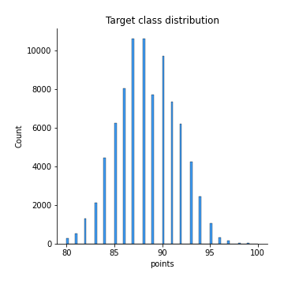
## Feature : c_Southwest France
- **Feature type** : discrete
- **Missing** : 0.0%
- **Unique** : 2
- **Count** :83694.0
- **Mean** :0.010681769302458958
- **Std** :0.10279978294767285
- **Min** :0.0
- **25%th Percentile** : 0.0
- **50%th Percentile** : 0.0
- **75%th Percentile** : 0.0
- **Max** :1.0

## Feature : c_Cabernet Sauvignon
- **Feature type** : discrete
- **Missing** : 0.0%
- **Unique** : 2
- **Count** :83694.0
- **Mean** :0.07780725022104333
- **Std** :0.2678696313007357
- **Min** :0.0
- **25%th Percentile** : 0.0
- **50%th Percentile** : 0.0
- **75%th Percentile** : 0.0
- **Max** :1.0

## Feature : c_New Mexico
- **Feature type** : discrete
- **Missing** : 0.0%
- **Unique** : 2
- **Count** :83694.0
- **Mean** :0.0004062417855521304
- **Std** :0.02015146657550498
- **Min** :0.0
- **25%th Percentile** : 0.0
- **50%th Percentile** : 0.0
- **75%th Percentile** : 0.0
- **Max** :1.0

## Feature : c_Brazil
- **Feature type** : discrete
- **Missing** : 0.0%
- **Unique** : 2
- **Count** :83694.0
- **Mean** :0.0003942934977417736
- **Std** :0.019853028477043608
- **Min** :0.0
- **25%th Percentile** : 0.0
- **50%th Percentile** : 0.0
- **75%th Percentile** : 0.0
- **Max** :1.0

## Feature : c_Northern Spain
- **Feature type** : discrete
- **Missing** : 0.0%
- **Unique** : 2
- **Count** :83694.0
- **Mean** :0.03089827227758262
- **Std** :0.17304313573932628
- **Min** :0.0
- **25%th Percentile** : 0.0
- **50%th Percentile** : 0.0
- **75%th Percentile** : 0.0
- **Max** :1.0

## Feature : c_Andalucia
- **Feature type** : discrete
- **Missing** : 0.0%
- **Unique** : 2
- **Count** :83694.0
- **Mean** :0.0013382082347599589
- **Std** :0.036557261953971625
- **Min** :0.0
- **25%th Percentile** : 0.0
- **50%th Percentile** : 0.0
- **75%th Percentile** : 0.0
- **Max** :1.0

## Feature : c_Burgundy
- **Feature type** : discrete
- **Missing** : 0.0%
- **Unique** : 2
- **Count** :83694.0
- **Mean** :0.025736611943508497
- **Std** :0.15834941852428328
- **Min** :0.0
- **25%th Percentile** : 0.0
- **50%th Percentile** : 0.0
- **75%th Percentile** : 0.0
- **Max** :1.0

## Feature : c_Texas
- **Feature type** : discrete
- **Missing** : 0.0%
- **Unique** : 2
- **Count** :83694.0
- **Mean** :0.0008722250101560446
- **Std** :0.029520749419985882
- **Min** :0.0
- **25%th Percentile** : 0.0
- **50%th Percentile** : 0.0
- **75%th Percentile** : 0.0
- **Max** :1.0

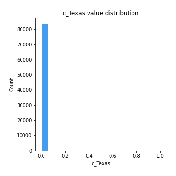
## Feature : c_Oregon
- **Feature type** : discrete
- **Missing** : 0.0%
- **Unique** : 2
- **Count** :83694.0
- **Mean** :0.04449542380576863
- **Std** :0.2061942992921539
- **Min** :0.0
- **25%th Percentile** : 0.0
- **50%th Percentile** : 0.0
- **75%th Percentile** : 0.0
- **Max** :1.0

## Feature : c_Italy
- **Feature type** : discrete
- **Missing** : 0.0%
- **Unique** : 2
- **Count** :83694.0
- **Mean** :0.13944846703467392
- **Std** :0.3464159723785747
- **Min** :0.0
- **25%th Percentile** : 0.0
- **50%th Percentile** : 0.0
- **75%th Percentile** : 0.0
- **Max** :1.0

## Feature : c_Dão
- **Feature type** : discrete
- **Missing** : 0.0%
- **Unique** : 2
- **Count** :83694.0
- **Mean** :0.00259277845484742
- **Std** :0.050853582509411605
- **Min** :0.0
- **25%th Percentile** : 0.0
- **50%th Percentile** : 0.0
- **75%th Percentile** : 0.0
- **Max** :1.0

## Feature : w_alcohol
- **Feature type** : discrete
- **Missing** : 0.0%
- **Unique** : 2
- **Count** :83694.0
- **Mean** :0.029034339379166964
- **Std** :0.16790379197126237
- **Min** :0.0
- **25%th Percentile** : 0.0
- **50%th Percentile** : 0.0
- **75%th Percentile** : 0.0
- **Max** :1.0

## Feature : w_time
- **Feature type** : discrete
- **Missing** : 0.0%
- **Unique** : 2
- **Count** :83694.0
- **Mean** :0.03854517647621096
- **Std** :0.19250945080396575
- **Min** :0.0
- **25%th Percentile** : 0.0
- **50%th Percentile** : 0.0
- **75%th Percentile** : 0.0
- **Max** :1.0

## Feature : c_France
- **Feature type** : discrete
- **Missing** : 0.0%
- **Unique** : 2
- **Count** :83694.0
- **Mean** :0.14494467942743805
- **Std** :0.3520471561743587
- **Min** :0.0
- **25%th Percentile** : 0.0
- **50%th Percentile** : 0.0
- **75%th Percentile** : 0.0
- **Max** :1.0

## Feature : w_still
- **Feature type** : discrete
- **Missing** : 0.0%
- **Unique** : 2
- **Count** :83694.0
- **Mean** :0.043479819341888305
- **Std** :0.2039358271100085
- **Min** :0.0
- **25%th Percentile** : 0.0
- **50%th Percentile** : 0.0
- **75%th Percentile** : 0.0
- **Max** :1.0

## Feature : w_savory
- **Feature type** : discrete
- **Missing** : 0.0%
- **Unique** : 2
- **Count** :83694.0
- **Mean** :0.040815351160178745
- **Std** :0.197863402488773
- **Min** :0.0
- **25%th Percentile** : 0.0
- **50%th Percentile** : 0.0
- **75%th Percentile** : 0.0
- **Max** :1.0

## Feature : c_Bordeaux
- **Feature type** : discrete
- **Missing** : 0.0%
- **Unique** : 2
- **Count** :83694.0
- **Mean** :0.03288168805410185
- **Std** :0.17832796362509631
- **Min** :0.0
- **25%th Percentile** : 0.0
- **50%th Percentile** : 0.0
- **75%th Percentile** : 0.0
- **Max** :1.0

## Feature : w_yellow
- **Feature type** : discrete
- **Missing** : 0.0%
- **Unique** : 2
- **Count** :83694.0
- **Mean** :0.031029703443496547
- **Std** :0.17339902018035108
- **Min** :0.0
- **25%th Percentile** : 0.0
- **50%th Percentile** : 0.0
- **75%th Percentile** : 0.0
- **Max** :1.0

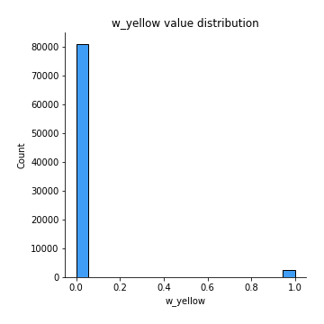
## Feature : w_chocolate
- **Feature type** : discrete
- **Missing** : 0.0%
- **Unique** : 2
- **Count** :83694.0
- **Mean** :0.06765120558224007
- **Std** :0.2511479118110129
- **Min** :0.0
- **25%th Percentile** : 0.0
- **50%th Percentile** : 0.0
- **75%th Percentile** : 0.0
- **Max** :1.0

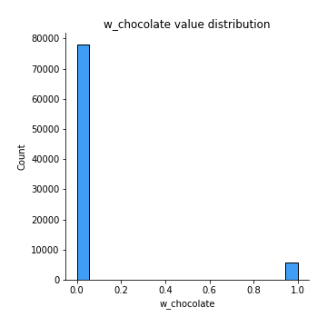
## Feature : w_citrus
- **Feature type** : discrete
- **Missing** : 0.0%
- **Unique** : 2
- **Count** :83694.0
- **Mean** :0.09599254426840634
- **Std** :0.2945827771168955
- **Min** :0.0
- **25%th Percentile** : 0.0
- **50%th Percentile** : 0.0
- **75%th Percentile** : 0.0
- **Max** :1.0

## Feature : c_New York
- **Feature type** : discrete
- **Missing** : 0.0%
- **Unique** : 2
- **Count** :83694.0
- **Mean** :0.021817573541711474
- **Std** :0.14608840482630864
- **Min** :0.0
- **25%th Percentile** : 0.0
- **50%th Percentile** : 0.0
- **75%th Percentile** : 0.0
- **Max** :1.0

## Feature : w_much
- **Feature type** : discrete
- **Missing** : 0.0%
- **Unique** : 2
- **Count** :83694.0
- **Mean** :0.022283556766315386
- **Std** :0.14760508183871265
- **Min** :0.0
- **25%th Percentile** : 0.0
- **50%th Percentile** : 0.0
- **75%th Percentile** : 0.0
- **Max** :1.0

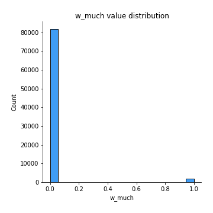
## Feature : w_peach
- **Feature type** : discrete
- **Missing** : 0.0%
- **Unique** : 2
- **Count** :83694.0
- **Mean** :0.07382847038019452
- **Std** :0.2614931057394019
- **Min** :0.0
- **25%th Percentile** : 0.0
- **50%th Percentile** : 0.0
- **75%th Percentile** : 0.0
- **Max** :1.0

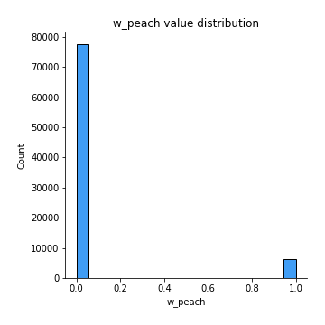
## Feature : w_cinnamon
- **Feature type** : discrete
- **Missing** : 0.0%
- **Unique** : 2
- **Count** :83694.0
- **Mean** :0.02823380409587306
- **Std** :0.16564113084355928
- **Min** :0.0
- **25%th Percentile** : 0.0
- **50%th Percentile** : 0.0
- **75%th Percentile** : 0.0
- **Max** :1.0

## Feature : w_core
- **Feature type** : discrete
- **Missing** : 0.0%
- **Unique** : 2
- **Count** :83694.0
- **Mean** :0.03190192845365259
- **Std** :0.1757400478896468
- **Min** :0.0
- **25%th Percentile** : 0.0
- **50%th Percentile** : 0.0
- **75%th Percentile** : 0.0
- **Max** :1.0

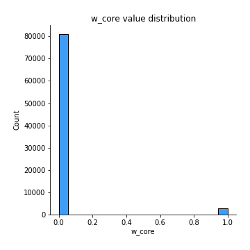
## Feature : w_make
- **Feature type** : discrete
- **Missing** : 0.0%
- **Unique** : 2
- **Count** :83694.0
- **Mean** :0.05332520849762229
- **Std** :0.22468251781695497
- **Min** :0.0
- **25%th Percentile** : 0.0
- **50%th Percentile** : 0.0
- **75%th Percentile** : 0.0
- **Max** :1.0

## Feature : c_Alsace
- **Feature type** : discrete
- **Missing** : 0.0%
- **Unique** : 2
- **Count** :83694.0
- **Mean** :0.017444500203120893
- **Std** :0.13092132910320553
- **Min** :0.0
- **25%th Percentile** : 0.0
- **50%th Percentile** : 0.0
- **75%th Percentile** : 0.0
- **Max** :1.0

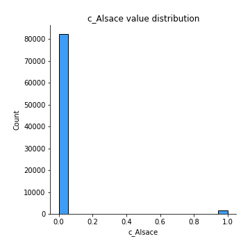
## Feature : c_Valle de Guadalupe
- **Feature type** : discrete
- **Missing** : 0.0%
- **Unique** : 2
- **Count** :83694.0
- **Mean** :0.0005735178148971252
- **Std** :0.02394150665519622
- **Min** :0.0
- **25%th Percentile** : 0.0
- **50%th Percentile** : 0.0
- **75%th Percentile** : 0.0
- **Max** :1.0

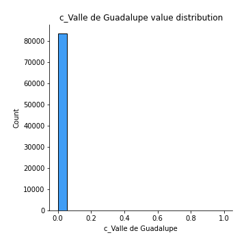
## Feature : w_texture
- **Feature type** : discrete
- **Missing** : 0.0%
- **Unique** : 2
- **Count** :83694.0
- **Mean** :0.11423757975482113
- **Std** :0.3181014997711731
- **Min** :0.0
- **25%th Percentile** : 0.0
- **50%th Percentile** : 0.0
- **75%th Percentile** : 0.0
- **Max** :1.0

## Feature : w_little
- **Feature type** : discrete
- **Missing** : 0.0%
- **Unique** : 2
- **Count** :83694.0
- **Mean** :0.03105360001911726
- **Std** :0.17346363729776532
- **Min** :0.0
- **25%th Percentile** : 0.0
- **50%th Percentile** : 0.0
- **75%th Percentile** : 0.0
- **Max** :1.0

## Feature : c_Central Spain
- **Feature type** : discrete
- **Missing** : 0.0%
- **Unique** : 2
- **Count** :83694.0
- **Mean** :0.0040624178555213036
- **Std** :0.06360788440923303
- **Min** :0.0
- **25%th Percentile** : 0.0
- **50%th Percentile** : 0.0
- **75%th Percentile** : 0.0
- **Max** :1.0

## Feature : w_white
- **Feature type** : discrete
- **Missing** : 0.0%
- **Unique** : 2
- **Count** :83694.0
- **Mean** :0.09129686715893612
- **Std** :0.28803253369819243
- **Min** :0.0
- **25%th Percentile** : 0.0
- **50%th Percentile** : 0.0
- **75%th Percentile** : 0.0
- **Max** :1.0

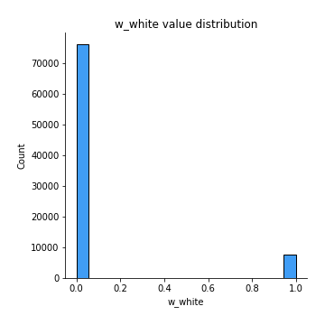
## Feature : w_glass
- **Feature type** : discrete
- **Missing** : 0.0%
- **Unique** : 2
- **Count** :83694.0
- **Mean** :0.025151145840801012
- **Std** :0.1565849886230345
- **Min** :0.0
- **25%th Percentile** : 0.0
- **50%th Percentile** : 0.0
- **75%th Percentile** : 0.0
- **Max** :1.0

## Feature : w_lemon
- **Feature type** : discrete
- **Missing** : 0.0%
- **Unique** : 2
- **Count** :83694.0
- **Mean** :0.08446244653141205
- **Std** :0.27808176066051465
- **Min** :0.0
- **25%th Percentile** : 0.0
- **50%th Percentile** : 0.0
- **75%th Percentile** : 0.0
- **Max** :1.0

## Feature : w_smoke
- **Feature type** : discrete
- **Missing** : 0.0%
- **Unique** : 2
- **Count** :83694.0
- **Mean** :0.03162711783401439
- **Std** :0.17500631186970955
- **Min** :0.0
- **25%th Percentile** : 0.0
- **50%th Percentile** : 0.0
- **75%th Percentile** : 0.0
- **Max** :1.0

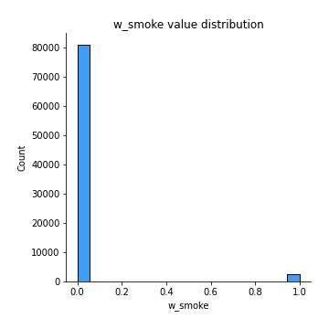
## Feature : w_cola
- **Feature type** : discrete
- **Missing** : 0.0%
- **Unique** : 2
- **Count** :83694.0
- **Mean** :0.1039381556622936
- **Std** :0.30518212312827336
- **Min** :0.0
- **25%th Percentile** : 0.0
- **50%th Percentile** : 0.0
- **75%th Percentile** : 0.0
- **Max** :1.0

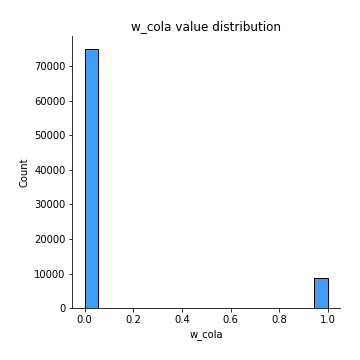
## Feature : w_richness
- **Feature type** : discrete
- **Missing** : 0.0%
- **Unique** : 2
- **Count** :83694.0
- **Mean** :0.03308480894687791
- **Std** :0.1788591250022273
- **Min** :0.0
- **25%th Percentile** : 0.0
- **50%th Percentile** : 0.0
- **75%th Percentile** : 0.0
- **Max** :1.0

## Feature : w_drink
- **Feature type** : discrete
- **Missing** : 0.0%
- **Unique** : 2
- **Count** :83694.0
- **Mean** :0.2601381222070877
- **Std** :0.43871241064236755
- **Min** :0.0
- **25%th Percentile** : 0.0
- **50%th Percentile** : 0.0
- **75%th Percentile** : 1.0
- **Max** :1.0

## Feature : c_South Australia
- **Feature type** : discrete
- **Missing** : 0.0%
- **Unique** : 2
- **Count** :83694.0
- **Mean** :0.011482304585752862
- **Std** :0.10653918005762619
- **Min** :0.0
- **25%th Percentile** : 0.0
- **50%th Percentile** : 0.0
- **75%th Percentile** : 0.0
- **Max** :1.0

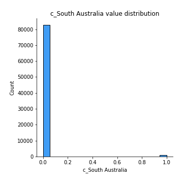
## Feature : c_California
- **Feature type** : discrete
- **Missing** : 0.0%
- **Unique** : 2
- **Count** :83694.0
- **Mean** :0.30103711138193895
- **Std** :0.4587115466903651
- **Min** :0.0
- **25%th Percentile** : 0.0
- **50%th Percentile** : 0.0
- **75%th Percentile** : 1.0
- **Max** :1.0

## Feature : w_crushed
- **Feature type** : discrete
- **Missing** : 0.0%
- **Unique** : 2
- **Count** :83694.0
- **Mean** :0.024625421177145314
- **Std** :0.15498160148373957
- **Min** :0.0
- **25%th Percentile** : 0.0
- **50%th Percentile** : 0.0
- **75%th Percentile** : 0.0
- **Max** :1.0

## Feature : w_spices
- **Feature type** : discrete
- **Missing** : 0.0%
- **Unique** : 2
- **Count** :83694.0
- **Mean** :0.023992161923196406
- **Std** :0.15302554649576378
- **Min** :0.0
- **25%th Percentile** : 0.0
- **50%th Percentile** : 0.0
- **75%th Percentile** : 0.0
- **Max** :1.0

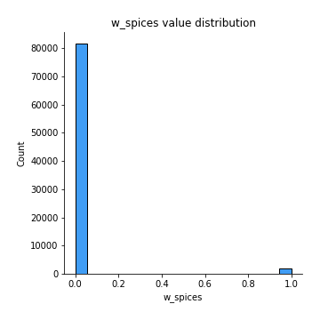
## Feature : w_lively
- **Feature type** : discrete
- **Missing** : 0.0%
- **Unique** : 2
- **Count** :83694.0
- **Mean** :0.03241570482949793
- **Std** :0.17710251740603927
- **Min** :0.0
- **25%th Percentile** : 0.0
- **50%th Percentile** : 0.0
- **75%th Percentile** : 0.0
- **Max** :1.0

## Feature : w_silky
- **Feature type** : discrete
- **Missing** : 0.0%
- **Unique** : 2
- **Count** :83694.0
- **Mean** :0.023382799244868212
- **Std** :0.15111689779514417
- **Min** :0.0
- **25%th Percentile** : 0.0
- **50%th Percentile** : 0.0
- **75%th Percentile** : 0.0
- **Max** :1.0

## Feature : w_bottling
- **Feature type** : discrete
- **Missing** : 0.0%
- **Unique** : 2
- **Count** :83694.0
- **Mean** :0.031113341458169044
- **Std** :0.1736250604910415
- **Min** :0.0
- **25%th Percentile** : 0.0
- **50%th Percentile** : 0.0
- **75%th Percentile** : 0.0
- **Max** :1.0

## Feature : c_Bulgaria
- **Feature type** : discrete
- **Missing** : 0.0%
- **Unique** : 2
- **Count** :83694.0
- **Mean** :0.0012067770688460344
- **Std** :0.034717937145566945
- **Min** :0.0
- **25%th Percentile** : 0.0
- **50%th Percentile** : 0.0
- **75%th Percentile** : 0.0
- **Max** :1.0

## Feature : w_spicy
- **Feature type** : discrete
- **Missing** : 0.0%
- **Unique** : 2
- **Count** :83694.0
- **Mean** :0.054448347551795825
- **Std** :0.2269016089638602
- **Min** :0.0
- **25%th Percentile** : 0.0
- **50%th Percentile** : 0.0
- **75%th Percentile** : 0.0
- **Max** :1.0

## Feature : w_bright
- **Feature type** : discrete
- **Missing** : 0.0%
- **Unique** : 2
- **Count** :83694.0
- **Mean** :0.09145219490047077
- **Std** :0.2882528121767632
- **Min** :0.0
- **25%th Percentile** : 0.0
- **50%th Percentile** : 0.0
- **75%th Percentile** : 0.0
- **Max** :1.0

## Feature : w_aging
- **Feature type** : discrete
- **Missing** : 0.0%
- **Unique** : 2
- **Count** :83694.0
- **Mean** :0.03828231414438311
- **Std** :0.19187813442614182
- **Min** :0.0
- **25%th Percentile** : 0.0
- **50%th Percentile** : 0.0
- **75%th Percentile** : 0.0
- **Max** :1.0

## Feature : w_firm
- **Feature type** : discrete
- **Missing** : 0.0%
- **Unique** : 2
- **Count** :83694.0
- **Mean** :0.07517862690276483
- **Std** :0.26368092781984437
- **Min** :0.0
- **25%th Percentile** : 0.0
- **50%th Percentile** : 0.0
- **75%th Percentile** : 0.0
- **Max** :1.0

## Feature : w_fresh
- **Feature type** : discrete
- **Missing** : 0.0%
- **Unique** : 2
- **Count** :83694.0
- **Mean** :0.18225918225918225
- **Std** :0.3860602978094512
- **Min** :0.0
- **25%th Percentile** : 0.0
- **50%th Percentile** : 0.0
- **75%th Percentile** : 0.0
- **Max** :1.0

## Feature : w_delivers
- **Feature type** : discrete
- **Missing** : 0.0%
- **Unique** : 2
- **Count** :83694.0
- **Mean** :0.03186608359022152
- **Std** :0.1756445413997503
- **Min** :0.0
- **25%th Percentile** : 0.0
- **50%th Percentile** : 0.0
- **75%th Percentile** : 0.0
- **Max** :1.0

## Feature : w_pear
- **Feature type** : discrete
- **Missing** : 0.0%
- **Unique** : 2
- **Count** :83694.0
- **Mean** :0.07288455564317634
- **Std** :0.2599484652310331
- **Min** :0.0
- **25%th Percentile** : 0.0
- **50%th Percentile** : 0.0
- **75%th Percentile** : 0.0
- **Max** :1.0

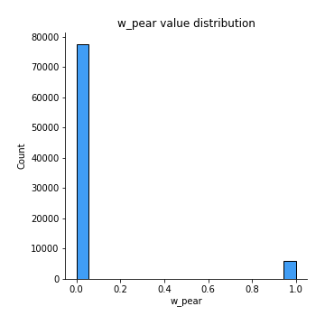
## Feature : w_grapefruit
- **Feature type** : discrete
- **Missing** : 0.0%
- **Unique** : 2
- **Count** :83694.0
- **Mean** :0.032618825722273995
- **Std** :0.17763787592054853
- **Min** :0.0
- **25%th Percentile** : 0.0
- **50%th Percentile** : 0.0
- **75%th Percentile** : 0.0
- **Max** :1.0

## Feature : c_US
- **Feature type** : discrete
- **Missing** : 0.0%
- **Unique** : 2
- **Count** :83694.0
- **Mean** :0.4507133127822783
- **Std** :0.4975678652665249
- **Min** :0.0
- **25%th Percentile** : 0.0
- **50%th Percentile** : 0.0
- **75%th Percentile** : 1.0
- **Max** :1.0

## Feature : c_Portuguese Red
- **Feature type** : discrete
- **Missing** : 0.0%
- **Unique** : 2
- **Count** :83694.0
- **Mean** :0.018137500896121588
- **Std** :0.13344940892103077
- **Min** :0.0
- **25%th Percentile** : 0.0
- **50%th Percentile** : 0.0
- **75%th Percentile** : 0.0
- **Max** :1.0

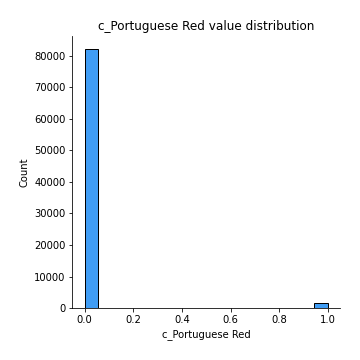
## Feature : w_smooth
- **Feature type** : discrete
- **Missing** : 0.0%
- **Unique** : 2
- **Count** :83694.0
- **Mean** :0.05978923220302531
- **Std** :0.23709734623231982
- **Min** :0.0
- **25%th Percentile** : 0.0
- **50%th Percentile** : 0.0
- **75%th Percentile** : 0.0
- **Max** :1.0

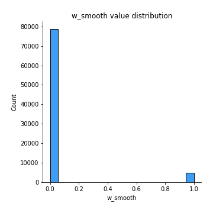
## Feature : w_bit
- **Feature type** : discrete
- **Missing** : 0.0%
- **Unique** : 2
- **Count** :83694.0
- **Mean** :0.08736588046932875
- **Std** :0.28237215883362005
- **Min** :0.0
- **25%th Percentile** : 0.0
- **50%th Percentile** : 0.0
- **75%th Percentile** : 0.0
- **Max** :1.0

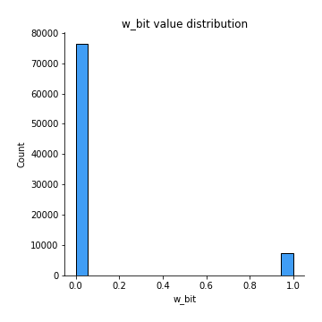
## Feature : w_floral
- **Feature type** : discrete
- **Missing** : 0.0%
- **Unique** : 2
- **Count** :83694.0
- **Mean** :0.03086242741415155
- **Std** :0.17294593191247748
- **Min** :0.0
- **25%th Percentile** : 0.0
- **50%th Percentile** : 0.0
- **75%th Percentile** : 0.0
- **Max** :1.0

## Feature : w_wild
- **Feature type** : discrete
- **Missing** : 0.0%
- **Unique** : 2
- **Count** :83694.0
- **Mean** :0.03198556646832509
- **Std** :0.1759626663789443
- **Min** :0.0
- **25%th Percentile** : 0.0
- **50%th Percentile** : 0.0
- **75%th Percentile** : 0.0
- **Max** :1.0

## Feature : w_cassis
- **Feature type** : discrete
- **Missing** : 0.0%
- **Unique** : 2
- **Count** :83694.0
- **Mean** :0.03529524219179392
- **Std** :0.18452613611182778
- **Min** :0.0
- **25%th Percentile** : 0.0
- **50%th Percentile** : 0.0
- **75%th Percentile** : 0.0
- **Max** :1.0

## Feature : c_Argentina
- **Feature type** : discrete
- **Missing** : 0.0%
- **Unique** : 2
- **Count** :83694.0
- **Mean** :0.031220876048462257
- **Std** :0.17391519295636151
- **Min** :0.0
- **25%th Percentile** : 0.0
- **50%th Percentile** : 0.0
- **75%th Percentile** : 0.0
- **Max** :1.0

## Feature : c_Mendoza Province
- **Feature type** : discrete
- **Missing** : 0.0%
- **Unique** : 2
- **Count** :83694.0
- **Mean** :0.026776112983009536
- **Std** :0.16142944007369958
- **Min** :0.0
- **25%th Percentile** : 0.0
- **50%th Percentile** : 0.0
- **75%th Percentile** : 0.0
- **Max** :1.0

## Feature : w_yet
- **Feature type** : discrete
- **Missing** : 0.0%
- **Unique** : 2
- **Count** :83694.0
- **Mean** :0.0368485196071403
- **Std** :0.18839089751933785
- **Min** :0.0
- **25%th Percentile** : 0.0
- **50%th Percentile** : 0.0
- **75%th Percentile** : 0.0
- **Max** :1.0

## Feature : c_Virginia
- **Feature type** : discrete
- **Missing** : 0.0%
- **Unique** : 2
- **Count** :83694.0
- **Mean** :0.006452075417592659
- **Std** :0.08006574008381495
- **Min** :0.0
- **25%th Percentile** : 0.0
- **50%th Percentile** : 0.0
- **75%th Percentile** : 0.0
- **Max** :1.0

## Feature : w_juicy
- **Feature type** : discrete
- **Missing** : 0.0%
- **Unique** : 2
- **Count** :83694.0
- **Mean** :0.07210791693550314
- **Std** :0.2586680589108031
- **Min** :0.0
- **25%th Percentile** : 0.0
- **50%th Percentile** : 0.0
- **75%th Percentile** : 0.0
- **Max** :1.0

## Feature : w_age
- **Feature type** : discrete
- **Missing** : 0.0%
- **Unique** : 2
- **Count** :83694.0
- **Mean** :0.14704757808206084
- **Std** :0.354155455258339
- **Min** :0.0
- **25%th Percentile** : 0.0
- **50%th Percentile** : 0.0
- **75%th Percentile** : 0.0
- **Max** :1.0

## Feature : w_long
- **Feature type** : discrete
- **Missing** : 0.0%
- **Unique** : 2
- **Count** :83694.0
- **Mean** :0.1342868067005998
- **Std** :0.3409622402817263
- **Min** :0.0
- **25%th Percentile** : 0.0
- **50%th Percentile** : 0.0
- **75%th Percentile** : 0.0
- **Max** :1.0

## Feature : w_zest
- **Feature type** : discrete
- **Missing** : 0.0%
- **Unique** : 2
- **Count** :83694.0
- **Mean** :0.045797787177097524
- **Std** :0.20904753530566975
- **Min** :0.0
- **25%th Percentile** : 0.0
- **50%th Percentile** : 0.0
- **75%th Percentile** : 0.0
- **Max** :1.0

## Feature : w_lime
- **Feature type** : discrete
- **Missing** : 0.0%
- **Unique** : 2
- **Count** :83694.0
- **Mean** :0.048079910148875665
- **Std** :0.21393639065736075
- **Min** :0.0
- **25%th Percentile** : 0.0
- **50%th Percentile** : 0.0
- **75%th Percentile** : 0.0
- **Max** :1.0

## Feature : c_Austria
- **Feature type** : discrete
- **Missing** : 0.0%
- **Unique** : 2
- **Count** :83694.0
- **Mean** :0.0233589026692475
- **Std** :0.15104150726883386
- **Min** :0.0
- **25%th Percentile** : 0.0
- **50%th Percentile** : 0.0
- **75%th Percentile** : 0.0
- **Max** :1.0

## Feature : w_dense
- **Feature type** : discrete
- **Missing** : 0.0%
- **Unique** : 2
- **Count** :83694.0
- **Mean** :0.04325280187349153
- **Std** :0.20342687003811027
- **Min** :0.0
- **25%th Percentile** : 0.0
- **50%th Percentile** : 0.0
- **75%th Percentile** : 0.0
- **Max** :1.0

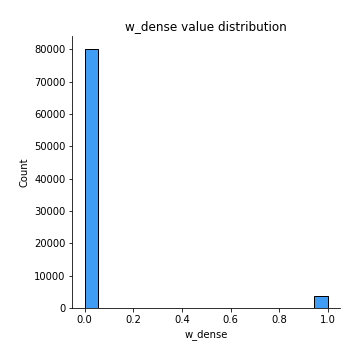
## Feature : w_intense
- **Feature type** : discrete
- **Missing** : 0.0%
- **Unique** : 2
- **Count** :83694.0
- **Mean** :0.03591655315793247
- **Std** :0.1860832289599649
- **Min** :0.0
- **25%th Percentile** : 0.0
- **50%th Percentile** : 0.0
- **75%th Percentile** : 0.0
- **Max** :1.0

## Feature : w_years
- **Feature type** : discrete
- **Missing** : 0.0%
- **Unique** : 2
- **Count** :83694.0
- **Mean** :0.05779386813869573
- **Std** :0.23335463908171644
- **Min** :0.0
- **25%th Percentile** : 0.0
- **50%th Percentile** : 0.0
- **75%th Percentile** : 0.0
- **Max** :1.0

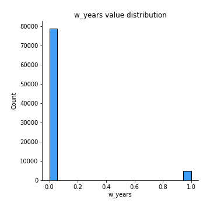
## Feature : w_well
- **Feature type** : discrete
- **Missing** : 0.0%
- **Unique** : 2
- **Count** :83694.0
- **Mean** :0.09568188878533707
- **Std** :0.29415624896310805
- **Min** :0.0
- **25%th Percentile** : 0.0
- **50%th Percentile** : 0.0
- **75%th Percentile** : 0.0
- **Max** :1.0

## Feature : w_tastes
- **Feature type** : discrete
- **Missing** : 0.0%
- **Unique** : 2
- **Count** :83694.0
- **Mean** :0.029846822950271225
- **Std** :0.17016561370818697
- **Min** :0.0
- **25%th Percentile** : 0.0
- **50%th Percentile** : 0.0
- **75%th Percentile** : 0.0
- **Max** :1.0

## Feature : w_black
- **Feature type** : discrete
- **Missing** : 0.0%
- **Unique** : 2
- **Count** :83694.0
- **Mean** :0.26480990274093724
- **Std** :0.44123456838609637
- **Min** :0.0
- **25%th Percentile** : 0.0
- **50%th Percentile** : 0.0
- **75%th Percentile** : 1.0
- **Max** :1.0

## Feature : c_Washington
- **Feature type** : discrete
- **Missing** : 0.0%
- **Unique** : 2
- **Count** :83694.0
- **Mean** :0.07035151862738069
- **Std** :0.25574003188323574
- **Min** :0.0
- **25%th Percentile** : 0.0
- **50%th Percentile** : 0.0
- **75%th Percentile** : 0.0
- **Max** :1.0

## Feature : w_best
- **Feature type** : discrete
- **Missing** : 0.0%
- **Unique** : 2
- **Count** :83694.0
- **Mean** :0.029249408559753387
- **Std** :0.16850584536142882
- **Min** :0.0
- **25%th Percentile** : 0.0
- **50%th Percentile** : 0.0
- **75%th Percentile** : 0.0
- **Max** :1.0

## Feature : w_bitter
- **Feature type** : discrete
- **Missing** : 0.0%
- **Unique** : 2
- **Count** :83694.0
- **Mean** :0.03312065381030898
- **Std** :0.17895267177149735
- **Min** :0.0
- **25%th Percentile** : 0.0
- **50%th Percentile** : 0.0
- **75%th Percentile** : 0.0
- **Max** :1.0

## Feature : w_one
- **Feature type** : discrete
- **Missing** : 0.0%
- **Unique** : 2
- **Count** :83694.0
- **Mean** :0.1979472841541807
- **Std** :0.3984545818944368
- **Min** :0.0
- **25%th Percentile** : 0.0
- **50%th Percentile** : 0.0
- **75%th Percentile** : 0.0
- **Max** :1.0

## Feature : w_generous
- **Feature type** : discrete
- **Missing** : 0.0%
- **Unique** : 2
- **Count** :83694.0
- **Mean** :0.02694338901235453
- **Std** :0.16191897991952206
- **Min** :0.0
- **25%th Percentile** : 0.0
- **50%th Percentile** : 0.0
- **75%th Percentile** : 0.0
- **Max** :1.0

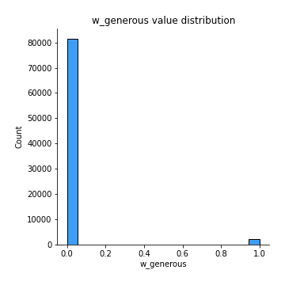
## Feature : w_along
- **Feature type** : discrete
- **Missing** : 0.0%
- **Unique** : 2
- **Count** :83694.0
- **Mean** :0.0800535283293904
- **Std** :0.27137767202389496
- **Min** :0.0
- **25%th Percentile** : 0.0
- **50%th Percentile** : 0.0
- **75%th Percentile** : 0.0
- **Max** :1.0

## Feature : w_spice
- **Feature type** : discrete
- **Missing** : 0.0%
- **Unique** : 2
- **Count** :83694.0
- **Mean** :0.1735966735966736
- **Std** :0.3787645477669089
- **Min** :0.0
- **25%th Percentile** : 0.0
- **50%th Percentile** : 0.0
- **75%th Percentile** : 0.0
- **Max** :1.0

## Feature : w_full
- **Feature type** : discrete
- **Missing** : 0.0%
- **Unique** : 2
- **Count** :83694.0
- **Mean** :0.14732238870169906
- **Std** :0.35442912328543247
- **Min** :0.0
- **25%th Percentile** : 0.0
- **50%th Percentile** : 0.0
- **75%th Percentile** : 0.0
- **Max** :1.0

## Feature : w_fine
- **Feature type** : discrete
- **Missing** : 0.0%
- **Unique** : 2
- **Count** :83694.0
- **Mean** :0.08275384137453103
- **Std** :0.2755114336386003
- **Min** :0.0
- **25%th Percentile** : 0.0
- **50%th Percentile** : 0.0
- **75%th Percentile** : 0.0
- **Max** :1.0

## Feature : w_mineral
- **Feature type** : discrete
- **Missing** : 0.0%
- **Unique** : 2
- **Count** :83694.0
- **Mean** :0.08490453318039524
- **Std** :0.27874124518651716
- **Min** :0.0
- **25%th Percentile** : 0.0
- **50%th Percentile** : 0.0
- **75%th Percentile** : 0.0
- **Max** :1.0

## Feature : w_dark
- **Feature type** : discrete
- **Missing** : 0.0%
- **Unique** : 2
- **Count** :83694.0
- **Mean** :0.0916911606566779
- **Std** :0.2885912105832526
- **Min** :0.0
- **25%th Percentile** : 0.0
- **50%th Percentile** : 0.0
- **75%th Percentile** : 0.0
- **Max** :1.0

## Feature : c_Riesling
- **Feature type** : discrete
- **Missing** : 0.0%
- **Unique** : 2
- **Count** :83694.0
- **Mean** :0.04124548952135159
- **Std** :0.1988586724480686
- **Min** :0.0
- **25%th Percentile** : 0.0
- **50%th Percentile** : 0.0
- **75%th Percentile** : 0.0
- **Max** :1.0

## Feature : w_balance
- **Feature type** : discrete
- **Missing** : 0.0%
- **Unique** : 2
- **Count** :83694.0
- **Mean** :0.1127559920663369
- **Std** :0.31629618028882406
- **Min** :0.0
- **25%th Percentile** : 0.0
- **50%th Percentile** : 0.0
- **75%th Percentile** : 0.0
- **Max** :1.0

## Feature : w_rich
- **Feature type** : discrete
- **Missing** : 0.0%
- **Unique** : 2
- **Count** :83694.0
- **Mean** :0.17009582526823905
- **Std** :0.37571920655414276
- **Min** :0.0
- **25%th Percentile** : 0.0
- **50%th Percentile** : 0.0
- **75%th Percentile** : 0.0
- **Max** :1.0

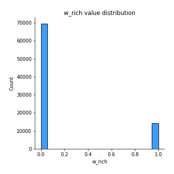
## Feature : w_structure
- **Feature type** : discrete
- **Missing** : 0.0%
- **Unique** : 2
- **Count** :83694.0
- **Mean** :0.09182259182259182
- **Std** :0.2887770763886539
- **Min** :0.0
- **25%th Percentile** : 0.0
- **50%th Percentile** : 0.0
- **75%th Percentile** : 0.0
- **Max** :1.0

## Feature : w_delicious
- **Feature type** : discrete
- **Missing** : 0.0%
- **Unique** : 2
- **Count** :83694.0
- **Mean** :0.04571414916242503
- **Std** :0.20886571516523675
- **Min** :0.0
- **25%th Percentile** : 0.0
- **50%th Percentile** : 0.0
- **75%th Percentile** : 0.0
- **Max** :1.0

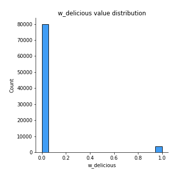
## Feature : w_great
- **Feature type** : discrete
- **Missing** : 0.0%
- **Unique** : 2
- **Count** :83694.0
- **Mean** :0.03760126173919277
- **Std** :0.19023101544577828
- **Min** :0.0
- **25%th Percentile** : 0.0
- **50%th Percentile** : 0.0
- **75%th Percentile** : 0.0
- **Max** :1.0

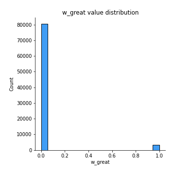
## Feature : w_elegant
- **Feature type** : discrete
- **Missing** : 0.0%
- **Unique** : 2
- **Count** :83694.0
- **Mean** :0.04447152723014792
- **Std** :0.2061415005046549
- **Min** :0.0
- **25%th Percentile** : 0.0
- **50%th Percentile** : 0.0
- **75%th Percentile** : 0.0
- **Max** :1.0

## Feature : w_complex
- **Feature type** : discrete
- **Missing** : 0.0%
- **Unique** : 2
- **Count** :83694.0
- **Mean** :0.06612182474251439
- **Std** :0.24849641214227808
- **Min** :0.0
- **25%th Percentile** : 0.0
- **50%th Percentile** : 0.0
- **75%th Percentile** : 0.0
- **Max** :1.0

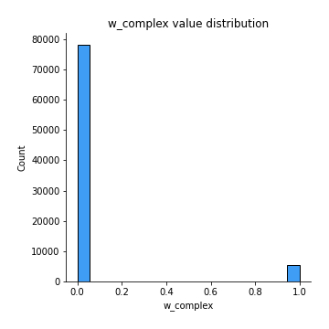
## Feature : w_vineyard
- **Feature type** : discrete
- **Missing** : 0.0%
- **Unique** : 2
- **Count** :83694.0
- **Mean** :0.06377996033168447
- **Std** :0.24436200698426824
- **Min** :0.0
- **25%th Percentile** : 0.0
- **50%th Percentile** : 0.0
- **75%th Percentile** : 0.0
- **Max** :1.0

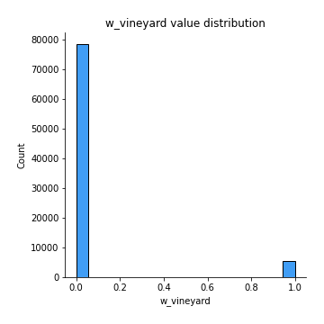
## Feature : w_concentrated
- **Feature type** : discrete
- **Missing** : 0.0%
- **Unique** : 2
- **Count** :83694.0
- **Mean** :0.04813965158792745
- **Std** :0.21406254468402666
- **Min** :0.0
- **25%th Percentile** : 0.0
- **50%th Percentile** : 0.0
- **75%th Percentile** : 0.0
- **Max** :1.0

## Feature : w_simple
- **Feature type** : discrete
- **Missing** : 0.0%
- **Unique** : 2
- **Count** :83694.0
- **Mean** :0.030145530145530147
- **Std** :0.17098867357628444
- **Min** :0.0
- **25%th Percentile** : 0.0
- **50%th Percentile** : 0.0
- **75%th Percentile** : 0.0
- **Max** :1.0

## Feature : price
- **Feature type** : continous
- **Missing** : 0.0%
- **Unique** : 355
- **Count** :83694.0
- **Mean** :35.529321098286616
- **Std** :42.15628679440329
- **Min** :4.0
- **25%th Percentile** : 17.0
- **50%th Percentile** : 25.0
- **75%th Percentile** : 42.0
- **Max** :3300.0

[<< Go back](../README.md)
